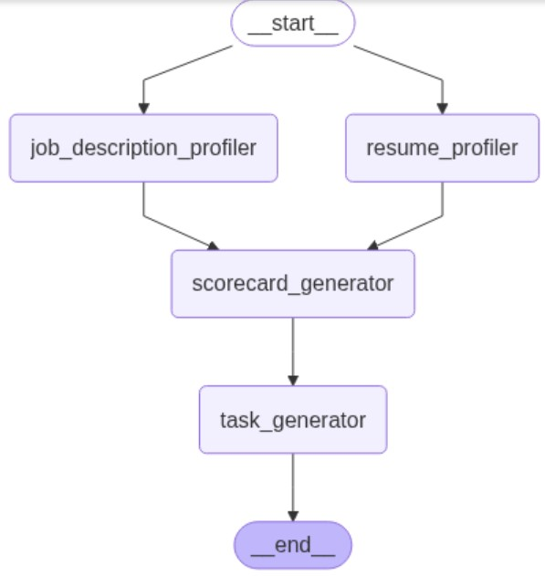

# Resume2Practice

An AI-powered platform that takes in your resume and a job description, analyzes your strengths and weaknesses, then creates a report that helps you understand how to improve your chances at landing your dream job. Additionally, we help you hone your skills to get there by generating scenarios and examples that are realistic to the role so you can practice what's needed to be successful.

**This is an initial proof-of-concept and is subject to change**

## Workflow diagram

## Architecture diagram

